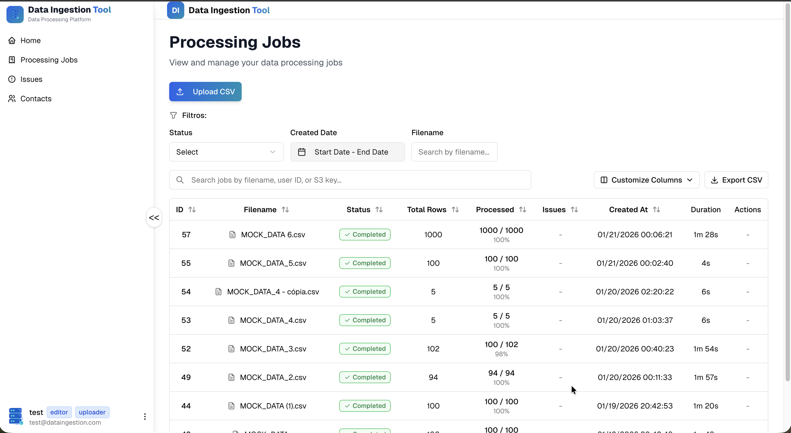
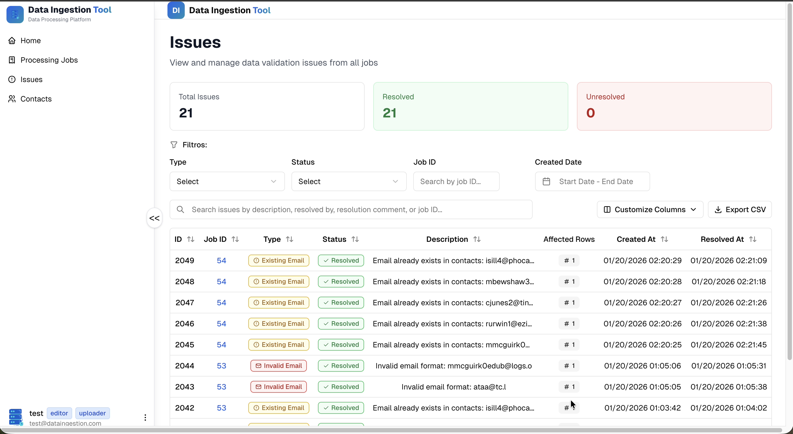
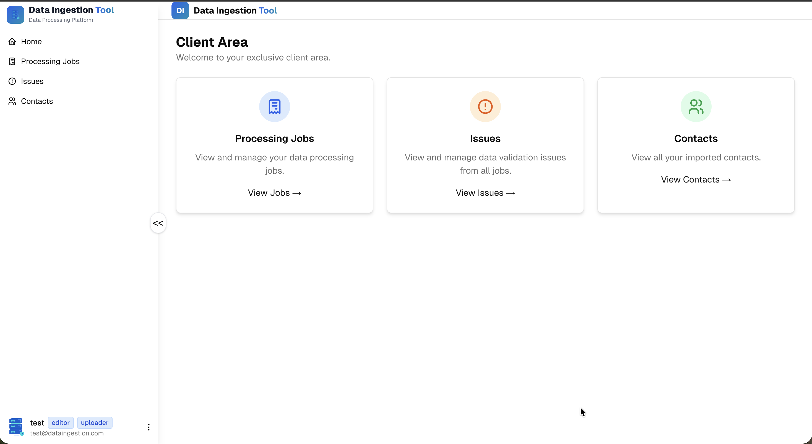
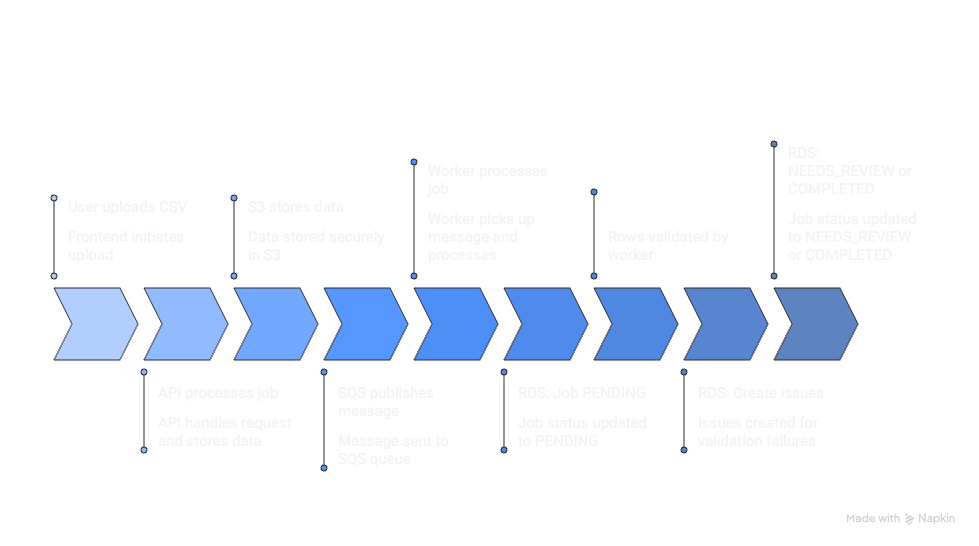
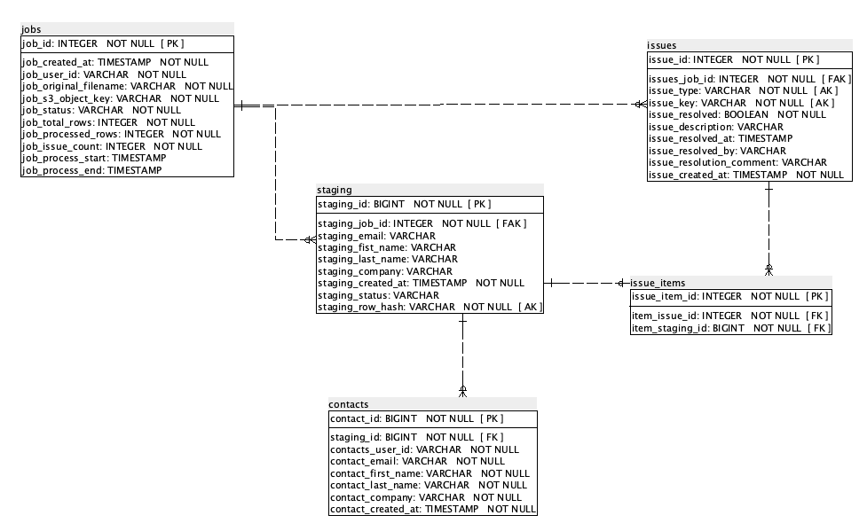

# Data Ingestion Tool

A production-ready, event-driven data ingestion platform with human-in-the-loop validation for CSV contact imports.

**Live Demo**: [https://app.rpdevelops.online](https://app.rpdevelops.online)  
**API Documentation**: [https://api.rpdevelops.online/docs](https://api.rpdevelops.online/docs)

---

## Application Screenshots

### Dashboard - Import Jobs Overview


### Issue Resolution Interface


### Landing Page


---

## Architecture


The platform implements an **event-driven, serverless architecture** on AWS:

| Component | Technology | Purpose |
|-----------|------------|---------|
| Frontend | Next.js 15 (ECS Fargate) | SSR web application with Cognito auth |
| Backend API | FastAPI (ECS Fargate) | REST API, file validation, job orchestration |
| Worker | Python (ECS Fargate) | Async CSV processing, validation, consolidation |
| Database | PostgreSQL (RDS) | Jobs, staging, issues, contacts persistence |
| Storage | S3 | CSV file storage |
| Queue | SQS | Job processing messages + DLQ |
| Auth | Cognito | User authentication and authorization |
| Load Balancer | ALB | SSL termination, host-based routing |
| DNS/CDN | Cloudflare | DNS, SSL, caching |

---

## System Flow



### Upload Flow

1. User authenticates via Cognito
2. Frontend sends CSV to API
3. API validates file (format, headers, duplicates, size)
4. API uploads CSV to S3
5. API creates job record (status: PENDING)
6. API publishes message to SQS
7. API returns job_id to frontend

### Processing Flow

1. Worker polls SQS for messages
2. Worker downloads CSV from S3
3. Worker identifies duplicate emails within CSV
4. Worker pre-loads existing contacts for email validation
5. Worker validates each row:
   - Required fields (email, first_name, last_name, company)
   - Email format
   - Duplicate emails (within CSV)
   - Existing emails (already in contacts)
6. Worker creates staging records and issues
7. Worker sets job status: NEEDS_REVIEW (if issues) or COMPLETED

### Resolution Flow

1. User views issues in frontend
2. User resolves conflicts (select winner, discard others)
3. User triggers reprocessing
4. Worker validates resolved issues
5. Worker consolidates READY rows to contacts table
6. Job marked as COMPLETED

---

## Key Features

- **Event-Driven Architecture**: Decoupled upload and processing via SQS
- **Human-in-the-Loop Validation**: Interactive issue resolution for data conflicts
- **Idempotent Processing**: Safe retries via row hashes and database constraints
- **Multi-Tenant Isolation**: User data separated via Cognito user IDs
- **CSV Flexibility**: Auto-detection of encoding and delimiter
- **Structured Logging**: CloudWatch-compatible JSON logs

---

## Issue Types

| Type | Description | Resolution |
|------|-------------|------------|
| DUPLICATE_EMAIL | Same email appears multiple times with different data | Select one candidate, discard others |
| INVALID_EMAIL | Email format is invalid | Edit or discard row |
| EXISTING_EMAIL | Email already exists in contacts | Discard row or update existing |
| MISSING_REQUIRED_FIELD | Required field is empty | Edit row data |

---

## Job Status Lifecycle

```
PENDING --> PROCESSING --> NEEDS_REVIEW --> COMPLETED
                |                               ^
                v                               |
              FAILED                    (after resolution)
```

---

## Repository Structure

This project is organized as a multi-repository architecture. Each component has its own repository:

| Repository | Description | Link |
|------------|-------------|------|
| **data-ingestion-frontend** | Next.js 15 web application | [GitHub](https://github.com/rpdevelops/data-ingestion-frontend) |
| **data-ingestion-backend** | FastAPI REST API | [GitHub](https://github.com/rpdevelops/data-ingestion-backend) |
| **data-ingestion-worker** | Python async processor | [GitHub](https://github.com/rpdevelops/data-ingestion-worker) |
| **data-ingestion-infra** | Terraform IaC | [GitHub](https://github.com/rpdevelops/data-ingestion-infra) |

---

## Quick Start

### Prerequisites

- AWS Account with appropriate permissions
- Docker
- Node.js 18+ and pnpm
- Python 3.11+
- Terraform 1.5+

### 1. Infrastructure Setup

```bash
git clone https://github.com/rpdevelops/data-ingestion-infra
cd data-ingestion-infra
terraform init
terraform apply -var-file=envs/prod.tfvars
```

See [data-ingestion-infra README](https://github.com/rpdevelops/data-ingestion-infra) for detailed instructions.

### 2. Database Schema

```bash
psql -h <rds-endpoint> -U dbadmin -d ingestion_db -f Database_Create.SQL
```

### 3. Backend API

```bash
git clone https://github.com/rpdevelops/data-ingestion-backend
cd data-ingestion-backend
python -m venv venv && source venv/bin/activate
pip install -r requirements.txt
# Configure .env with Terraform outputs
uvicorn src.app.main:app --reload --host 0.0.0.0 --port 8000
```

### 4. Worker

```bash
git clone https://github.com/rpdevelops/data-ingestion-worker
cd data-ingestion-worker
python -m venv venv && source venv/bin/activate
pip install -r requirements.txt
# Configure .env with Terraform outputs
python main.py
```

### 5. Frontend

```bash
git clone https://github.com/rpdevelops/data-ingestion-frontend
cd data-ingestion-frontend
pnpm install
# Configure .env.local with Cognito and API settings
pnpm dev
```

---

## Database Schema



The database schema is defined in `Database_Create.SQL`. Key tables:

| Table | Purpose |
|-------|---------|
| jobs | Import job lifecycle and metadata |
| staging | Imported rows before finalization |
| issues | Validation issues requiring user input |
| issue_items | Links issues to staging records |
| contacts | Finalized contact records |

Key constraints for idempotency:
- `UNIQUE (staging_job_id, staging_row_hash)` - Prevents duplicate row processing
- `UNIQUE (issues_job_id, issue_type, issue_key)` - Ensures idempotent issue creation

---

## Production URLs

| Service | URL |
|---------|-----|
| Frontend | [https://app.rpdevelops.online](https://app.rpdevelops.online) |
| API | [https://api.rpdevelops.online](https://api.rpdevelops.online) |
| API Docs (Swagger) | [https://api.rpdevelops.online/docs](https://api.rpdevelops.online/docs) |
| API Docs (ReDoc) | [https://api.rpdevelops.online/redoc](https://api.rpdevelops.online/redoc) |

---

## Security

- **Authentication**: AWS Cognito with JWT tokens
- **Authorization**: Cognito user groups (uploader, editor)
- **Network**: Private subnets for ECS tasks, ALB for public access
- **Encryption**: TLS in transit, AES-256 at rest (S3, RDS)
- **Secrets**: AWS Secrets Manager for sensitive configuration

---

## Future Improvements

- WebSocket for real-time job status updates
- Batch import support for large files (streaming)
- Export functionality for contacts
- Audit logging for compliance

---

## Author

**Robson Paradella Rocha**

---

## License

This project is proprietary and part of a portfolio demonstration.
